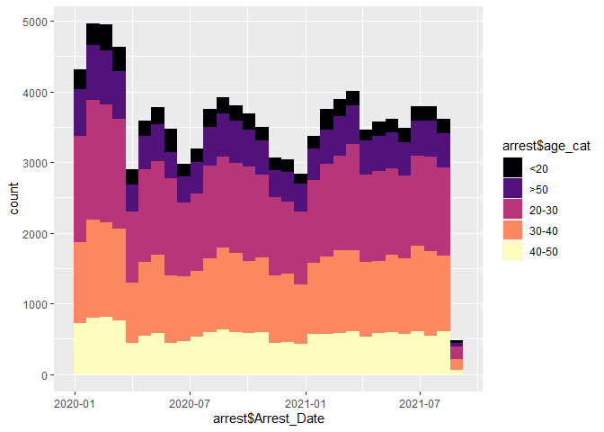
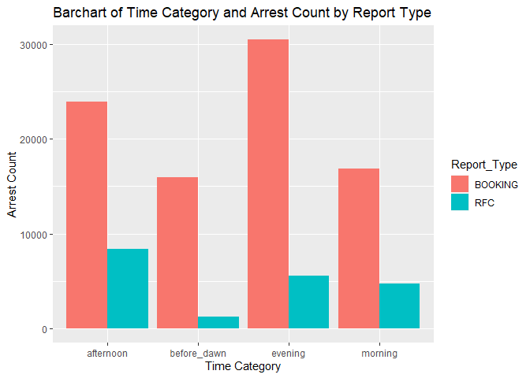
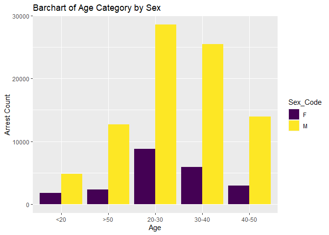
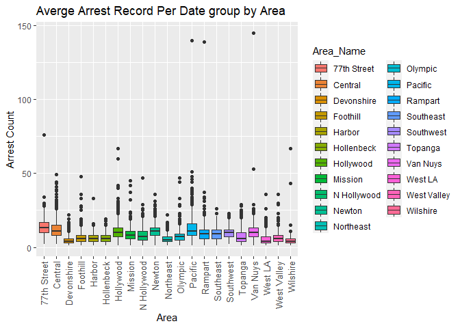
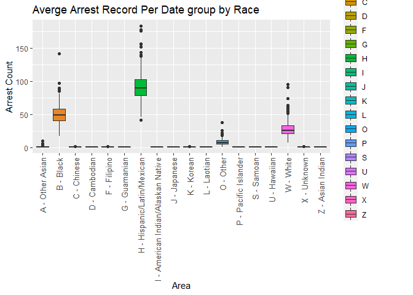
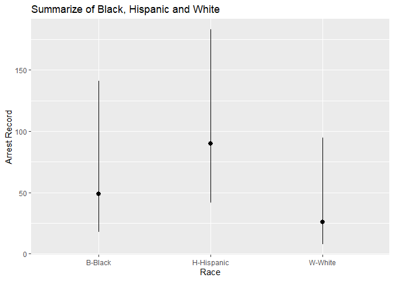
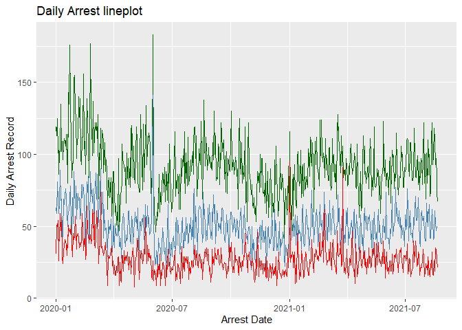
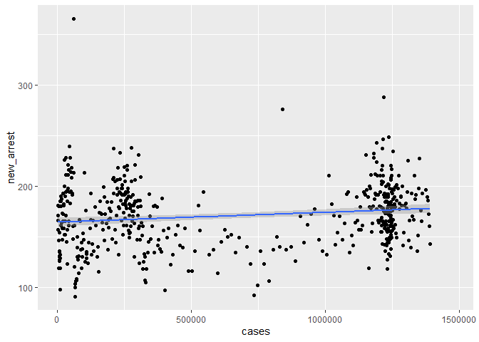
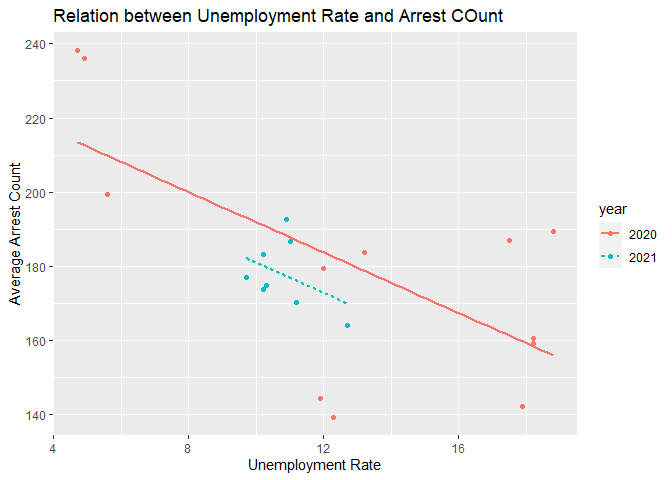
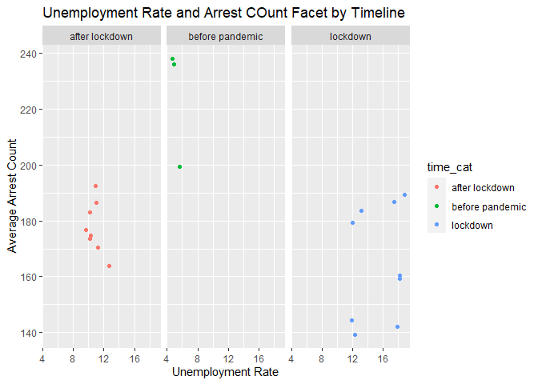

## Introduction
The COVID-19 has been impacting our world for over a year, causing economic distress, high rate of unemployment and tragic public health outcomes. Upon this situation, the society has changed drastically. For weeks, I've been receiving crime reports on campus, thus I want to find out if crime rates is related to the increasing COVID cases or unemployment rate in Los Angeles County.

## Method
The data was acquired from Los Angeles Open Data website. First the arrest data will be analyzed and visualized, which follows the analysis of COVID-19 cases. Then I will combine the arrest data with the COVID-19 cases and unemployment rate, to show if there is an association between them. Due to the large amount of data, we will only draw the first 10 observations for those tables with extremely large data.
## Package Installation

```r
library(data.table)
library(dtplyr)
library(dplyr)
library(readr)
library(tidyverse)
library(skimr)
library(lubridate)
library(leaflet)
library(ggplot2)
```
## Data Operation

```r
# Read CSV files
arrest20 <- read.csv("Arrest_Data_2020.csv")
arrest21 <- read.csv("Arrest_Data_2021.csv")
# using rbind to combine two datasets
arrest<- rbind(arrest20,arrest21)
```
## Transform the dates into date variables

```r
arrest$Arrest_Date<-strptime(arrest$Arrest_Date,format="%Y/%m/%d") 
arrest$Arrest_Date<-as.Date(arrest$Arrest_Date,format="%m/%d/%Y")
arrest$year <- year(arrest$Arrest_Date)
arrest$month <- month(arrest$Arrest_Date)
arrest$day <- day(arrest$Arrest_Date)
arrest$Booking_Date<-as.Date(arrest$Booking_Date,"%m/%d/%Y")
```
## remove data with unknown location and these ages are likely wrong(<8)

```r
arrest20<-arrest20[!(arrest20$LAT==0 | arrest20$LAT==0 | arrest20$Age<8),]
arrest21<-arrest21[!(arrest21$LAT==0 | arrest21$LAT==0 | arrest21$Age<8),]
arrest<-arrest[!(arrest$LAT==0 | arrest$LAT==0 | arrest$Age<8),]
```
## Make a time category that partitions day into four sections

```r
arrest$time_cat <- as.factor(ifelse(arrest$Time < 600, 'before_dawn',
                          ifelse(arrest$Time < 1200, 'morning', 
                          ifelse(arrest$Time < 1800, 'afternoon', "evening"))))
# Make a table 
table_time<-table(arrest$time_cat)
knitr::kable(table_time,col.names = c("Time Category","Arrest Records"))
```


|Time Category | Arrest Records|
|:-------------|--------------:|
|afternoon     |          32380|
|before_dawn   |          17181|
|evening       |          36005|
|morning       |          21633|
We can see that most arrests are recorded in the afternoon and in the evening. 
## Categorize the age of arrest

```r
arrest$age_cat <- as.factor(ifelse(arrest$Age < 20, '<20',
                          ifelse(arrest$Age < 30, '20-30',
                          ifelse(arrest$Age < 40, '30-40',
                          ifelse(arrest$Age < 50, '40-50',
                                 ">50")))))
# Make a table
table_age<-table(arrest$age_cat)
knitr::kable(table_age,col.names = c("Age Category","Arrest Records"))
```


|Age Category | Arrest Records|
|:------------|--------------:|
|<20          |           6574|
|>50          |          15017|
|20-30        |          37384|
|30-40        |          31415|
|40-50        |          16814|

People age in 20-40 contribute the most arrest records.

## Plot a histogram with age layers

```r
arrest[!is.na(month) & !is.na(year) & !is.na(time)] %>%
  ggplot() + 
  geom_histogram(mapping = aes(x = arrest$Arrest_Date, fill = arrest$age_cat))+
   scale_fill_viridis_d(option="magma")
```

<!-- -->

The age category in the time range is kind of stable.

## Barchart of Time Category and Arrest Count by Report Type

```r
arrest[!is.na(arrest$time_cat),] %>%
  ggplot() + 
  geom_bar(mapping = aes(x = time_cat, fill = Report_Type), position = "dodge")+
  xlab("Time Category") + ylab("Arrest Count")+
  ggtitle("Barchart of Time Category and Arrest Count by Report Type")
```

<!-- -->

In the afternoon, the largest number of suspects are likely to be released from custody while in the evening and before dawn, the suspects are more likely to be booked into jail.

## Sex-specific Arrest Record

```r
daily_count_sex<-arrest %>% 
  group_by(Arrest_Date,Sex_Code) %>% 
  summarise(total_arrest = n()
            )
daily_count_sex<-as.data.table(daily_count_sex)
knitr::kable(head(daily_count_sex,n=10))
```


|Arrest_Date |Sex_Code | total_arrest|
|:-----------|:--------|------------:|
|2020-01-01  |F        |           35|
|2020-01-01  |M        |          189|
|2020-01-02  |F        |           45|
|2020-01-02  |M        |          187|
|2020-01-03  |F        |           60|
|2020-01-03  |M        |          214|
|2020-01-04  |F        |           48|
|2020-01-04  |M        |          184|
|2020-01-05  |F        |           40|
|2020-01-05  |M        |          160|
## Barplot the table

```r
arrest[] %>%
  ggplot() + 
  geom_bar(mapping = aes(x = age_cat, fill = Sex_Code), position = "dodge")+
  scale_fill_viridis_d()+
  xlab("Age") + ylab("Arrest Count")+
  ggtitle("Barchart of Age Category by Sex")
```

<!-- -->

Male's arrest record is much higher than female's, while both appear to be normal distributed, with age 20-30 the most frequently arrested while male a little left-skewed.
## Averge Arrest Record Per Date group by Area

```r
daily_count_area<-arrest %>% 
  group_by(Arrest_Date,Area_Name) %>% 
  summarise(total_arrest = n()
            )
daily_count_area<-as.data.table(daily_count_area)
knitr::kable(head(daily_count_area,n=25))
```


|Arrest_Date |Area_Name   | total_arrest|
|:-----------|:-----------|------------:|
|2020-01-01  |77th Street |           14|
|2020-01-01  |Central     |           19|
|2020-01-01  |Devonshire  |            8|
|2020-01-01  |Foothill    |            6|
|2020-01-01  |Harbor      |            5|
|2020-01-01  |Hollenbeck  |           11|
|2020-01-01  |Hollywood   |           17|
|2020-01-01  |Mission     |           13|
|2020-01-01  |N Hollywood |           13|
|2020-01-01  |Newton      |           16|
|2020-01-01  |Northeast   |            9|
|2020-01-01  |Olympic     |           10|
|2020-01-01  |Pacific     |           13|
|2020-01-01  |Rampart     |           10|
|2020-01-01  |Southeast   |           11|
|2020-01-01  |Southwest   |           14|
|2020-01-01  |Topanga     |           10|
|2020-01-01  |Van Nuys    |           12|
|2020-01-01  |West LA     |            2|
|2020-01-01  |West Valley |            3|
|2020-01-01  |Wilshire    |            8|
|2020-01-02  |77th Street |           11|
|2020-01-02  |Central     |           22|
|2020-01-02  |Devonshire  |            5|
|2020-01-02  |Foothill    |            5|
## Make a boxplot 

```r
daily_count_area[!is.na(Area_Name)] %>% 
  ggplot()+
  geom_boxplot(mapping=aes(x=Area_Name, y=total_arrest, fill=Area_Name))+
  xlab("Area") + ylab("Arrest Count")+
  ggtitle("Averge Arrest Record Per Date group by Area")+
  theme(axis.text.x = element_text(angle=90, hjust=1, vjust=0.5,size = 10))
```

<!-- -->

By the plot above, 77th Street has the highest average number of arrest per day.
## What about race?

```r
daily_count_race<-arrest %>% 
  group_by(Arrest_Date,Descent_Code) %>% 
  summarise(total_arrest = n()
            )
daily_count_race<-as.data.table(daily_count_race)
knitr::kable(head(daily_count_race,n=10))
```


|Arrest_Date |Descent_Code | total_arrest|
|:-----------|:------------|------------:|
|2020-01-01  |A            |            1|
|2020-01-01  |B            |           63|
|2020-01-01  |H            |          119|
|2020-01-01  |O            |           10|
|2020-01-01  |W            |           31|
|2020-01-02  |A            |            1|
|2020-01-02  |B            |           59|
|2020-01-02  |H            |          113|
|2020-01-02  |O            |            8|
|2020-01-02  |W            |           51|

## Boxplot by race

```r
daily_count_race[!is.na(Descent_Code)] %>% 
  ggplot()+
  geom_boxplot(mapping=aes(x=Descent_Code, y=total_arrest, fill=Descent_Code))+
  xlab("Area") + ylab("Arrest Count")+
  ggtitle("Averge Arrest Record Per Date group by Race")+
  scale_x_discrete(labels=c("A - Other Asian", "B - Black", "C - Chinese", "D - Cambodian", "F - Filipino", "G - Guamanian", "H - Hispanic/Latin/Mexican", "I - American Indian/Alaskan Native", "J - Japanese", "K - Korean", "L - Laotian", "O - Other", "P - Pacific Islander", "S - Samoan", "U - Hawaiian", "W - White", "X - Unknown", "Z - Asian Indian"))+
  theme(axis.text.x = element_text(angle=90, hjust=1, vjust=0.5,size = 10))
```

<!-- -->

In this graph, we can observe that Hispanic, Black and White appears to have the three highest arrest record, probably because of their large population base.
## Make a table of the three highest arrest record races 

```r
arrest_BHW<-arrest[arrest$Descent_Code=="B"|arrest$Descent_Code=="H"|arrest$Descent_Code=="W",]
tb_BHW<-dcast(setDT(arrest[arrest$Descent_Code=="B" | arrest$Descent_Code=="H"| arrest$Descent_Code=="W",]), Arrest_Date~Descent_Code, value.var = "Arrest_Date",length)[]
knitr::kable(head(tb_BHW,n=10))
```


|Arrest_Date |  B|   H|  W|
|:-----------|--:|---:|--:|
|2020-01-01  | 63| 119| 31|
|2020-01-02  | 59| 113| 51|
|2020-01-03  | 81| 125| 50|
|2020-01-04  | 68| 101| 54|
|2020-01-05  | 60| 103| 26|
|2020-01-06  | 59|  86| 41|
|2020-01-07  | 65| 102| 40|
|2020-01-08  | 89| 102| 59|
|2020-01-09  | 68| 135| 47|
|2020-01-10  | 69| 102| 56|
## Focus on the three mostly recorded races

```r
daily_count_race[Descent_Code=="B" | Descent_Code=="H"| Descent_Code=="W"] %>%
  ggplot() + 
    stat_summary(mapping = aes(x = Descent_Code, y = total_arrest),
    fun.min = min,
    fun.max = max,
    fun = median)+
  scale_x_discrete(labels=c("B-Black","H-Hispanic","W-White"))+
  xlab("Race")+ylab("Arrest Record")+ggtitle("Summarize of Black, Hispanic and White")
```

<!-- -->

## Plot a lineplot 

```r
ggplot(tb_BHW, aes(x=Arrest_Date)) + 
  geom_line(aes(y = H), color = "darkgreen") + 
  geom_line(aes(y = B), color="steelblue") +
  geom_line(aes(y = W), color="red")+
  xlab("Arrest Date")+ylab("Daily Arrest Record")+ggtitle("Daily Arrest lineplot")
```

<!-- -->

Notice that the arrest record of the Black and Hispanic increased significantly on late May and Early Jun while that of Whites decreased. This is probably because of the riot of BLM activity after the death of Floyd. 

## We now pick three other races 

```r
arr_CJK<-arrest[arrest$Descent_Code=="C" | arrest$Descent_Code=="J"| arrest$Descent_Code=="K"|arrest$Descent_Code=="A",]
pal <- colorFactor(c("red","blue","green","yellow"), domain = arr_CJK$Descent_Code)
leaflet() %>% 
  addProviderTiles('CartoDB.Positron') %>% 
  addCircles(
    data = arr_CJK,
    lat = ~LAT, lng = ~LON, 
    opacity = 1, fillOpacity = 1, radius = 40, color = ~pal(arr_CJK$Descent_Code)
    ) %>%
  addLegend('bottomleft', pal=pal, values=arr_CJK$Descent_Code,
          title='Race', opacity=1)
```

```{=html}
<div id="htmlwidget-c03051a1924fe8aa971f" style="width:672px;height:480px;" class="leaflet html-widget"></div>
<script type="application/json" data-for="htmlwidget-c03051a1924fe8aa971f">{"x":{"options":{"crs":{"crsClass":"L.CRS.EPSG3857","code":null,"proj4def":null,"projectedBounds":null,"options":{}}},"calls":[{"method":"addProviderTiles","args":["CartoDB.Positron",null,null,{"errorTileUrl":"","noWrap":false,"detectRetina":false}]},{"method":"addCircles","args":[[34.0605,34.2355,34.2139,34.0148,34.103,34.2283,33.9599,34.0407,34.0328,34.2355,34.103,34.0998,33.9978,34.0486,34.0908,34.0721,34.1034,34.0617,34.034,34.069,34.0999,34.2048,34.256,34.0998,33.9918,34.1984,34.0725,34.0443,34.1367,34.19,34.0325,33.99,34.1903,34.1937,34.0545,34.1052,34.0734,34.0372,34.0361,34.0691,34.0691,34.0428,33.9906,34.0652,34.0598,33.9782,34.1495,33.9765,33.9489,34.0728,34.0674,34.0998,34.0433,34.098,33.989,34.0617,34.0623,34.1451,34.0597,34.314,34.0399,34.0494,34.0607,34.0508,34.048,34.0635,33.9813,33.9918,34.0783,34.0581,34.2535,34.1887,34.0515,34.0839,34.0691,34.0529,34.0473,34.0886,34.0426,34.1428,34.1034,34.0577,33.9955,34.1905,34.043,34.0472,33.9795,33.9918,34.261,34.0909,33.8234,34.145,34.1939,33.9918,33.9737,34.2048,34.2905,33.9929,33.7911,34.0577,34.201,34.0517,34.103,33.9918,33.9918,34.143,34.0636,34.2209,34.1478,34.0672,34.049,34.0731,34.0635,34.0467,33.9551,34.0854,34.0549,34.0526,33.7547,33.9918,34.2338,34.0617,34.1451,34.1683,34.0524,34.1505,34.0376,34.0709,34.0571,34.0527,34.1439,34.1451,33.9918,34.2148,34.2734,34.1367,34.1451,34.2354,34.1649,34.0799,34.0522,34.2647,34.0347,34.2355,34.145,34.0529,34.0462,34.0691,34.0608,33.979,34.0624,34.0761,34.0438,34.0761,34.0624,34.0385,34.0691,34.1703,34.1367,34.0148,34.1034,34.0308,34.2684,34.0278,34.0476,34.046,34.0577,34.1367,34.0623,34.1776,33.9427,33.9793,34.2355,34.0944,34.0515,34.244,34.0998,34.0674,34.0636,34.2734,34.2301,34.2651,33.9943,33.7817,34.2011,34.2029,33.9792,34.0712,34.0674,34.1505,34.0944,34.0454,34.0521,33.9976,34.0761,34.2285,34.2734,34.2308,33.9918,34.1478,34.2012,34.0577,33.988,34.261,34.2012,34.1907,34.0572,34.2355,34.0837,34.261,34.0798,34.0608,34.1435,33.9933,34.0529,33.9929,34.2355,34.0416,33.988,33.8202,34.0674,34.0712,34.2355,34.0545,34.2086,34.0691,33.9926,34.0577,33.7291,34.0653,34.1451,34.145,34.0712,34.0691,34.0526,34.0577,34.0634,34.043,34.0691,33.988,34.0761,33.707,34.0216,34.19,34.1451,34.0453,33.9791,34.0944,34.1721,34.1006,34.0529,33.99,34.043,34.2905,34.0671,34.1957,34.0691,34.0577,33.9918,34.1683,34.1439,34.103,34.1421,34.261,34.2355,34.0261,34.0349,34.0728,33.996,34.1884,34.2536,34.2685,34.2651,34.2734,34.0598,34.0598,34.0568,33.9946,33.942,34.0483,34.2646,34.036,34.2261,33.9795,34.0529,34.0653,34.056,34.0432,34.0506,34.098,34.0783,34.0508,33.9912,34.1726,34.0806,34.0763,34.1681,33.9918,33.9894,34.1707,34.0763,33.9918,34.0508,33.9806,34.0628,34.0601,33.9813,34.0908,34.0763,34.0409,34.0711,34.0711,34.0772,34.0711,34.0636,34.0677,34.0761,34.1012,34.0757,34.0757,34.0757,34.0437,34.2011,34.0735,34.0757,34.0545,34.0524,34.1367,33.9918,33.9695,34.1478,34.145,33.9958,34.2651,33.9932,34.0545,33.9918,34.2184,34.2184,34.081,34.0757,34.2084,34.0757,34.2084,34.0598,34.0735,34.0577,34.201,34.0909,34.0772,34.0509,34.0757,33.9713,33.9695,34.0408,34.0757,34.0427,34.2234,34.0465,34.0449,34.0509,34.0757,34.0276,34.1303,33.9792,34.0772,34.0757,34.0938,34.2414,33.9908,34.0757,34.0581,34.2066,34.0757,34.0454,34.0721,34.0395,34.0237,34.0387,34.0527,34.0349,34.0772,34.0577,33.9863,33.9703,34.0618,34.054,34.1957],[-118.4193,-118.558,-118.5768,-118.3222,-118.3225,-118.5492,-118.3962,-118.2468,-118.2865,-118.558,-118.3225,-118.3267,-118.2915,-118.2519,-118.3078,-118.2917,-118.3325,-118.3113,-118.3133,-118.3004,-118.3038,-118.4662,-118.2995,-118.3211,-118.4791,-118.4662,-118.3153,-118.2924,-118.2713,-118.5262,-118.2507,-118.4764,-118.4574,-118.6192,-118.2836,-118.3375,-118.3765,-118.276,-118.3805,-118.2954,-118.2954,-118.2461,-118.4769,-118.2857,-118.2865,-118.2827,-118.44,-118.2827,-118.3939,-118.3656,-118.2954,-118.3295,-118.2488,-118.3445,-118.4755,-118.3128,-118.2929,-118.3958,-118.302,-118.4841,-118.313,-118.3216,-118.3112,-118.3101,-118.2577,-118.3091,-118.2827,-118.4791,-118.3092,-118.3066,-118.4249,-118.5797,-118.2424,-118.2224,-118.2954,-118.2819,-118.3213,-118.1724,-118.2513,-118.226,-118.3325,-118.2318,-118.4807,-118.6059,-118.2641,-118.301,-118.2827,-118.4791,-118.4807,-118.2917,-118.3038,-118.3958,-118.4487,-118.4791,-118.2827,-118.4356,-118.5456,-118.4782,-118.2454,-118.2954,-118.5805,-118.2798,-118.3225,-118.4791,-118.4791,-118.3727,-118.296,-118.6032,-118.4071,-118.3066,-118.3066,-118.3091,-118.3091,-118.247,-118.2827,-118.3091,-118.2778,-118.3002,-118.3011,-118.4791,-118.4301,-118.3091,-118.3958,-118.6007,-118.2842,-118.4458,-118.4422,-118.2985,-118.2976,-118.1969,-118.3979,-118.3958,-118.4791,-118.3922,-118.4267,-118.2713,-118.3958,-118.4482,-118.4486,-118.3068,-118.281,-118.4517,-118.2792,-118.558,-118.3958,-118.2819,-118.2585,-118.2917,-118.2842,-118.2827,-118.2383,-118.3772,-118.2634,-118.3604,-118.2383,-118.2437,-118.2954,-118.4662,-118.2713,-118.3222,-118.3325,-118.4206,-118.5149,-118.4527,-118.2891,-118.2493,-118.3048,-118.2713,-118.2929,-118.3818,-118.4052,-118.4666,-118.558,-118.3266,-118.2424,-118.5583,-118.3319,-118.2954,-118.2979,-118.4267,-118.4633,-118.582,-118.2701,-118.3041,-118.5186,-118.5797,-118.4666,-118.359,-118.2954,-118.4458,-118.319,-118.2657,-118.2556,-118.467,-118.3563,-118.5008,-118.4267,-118.5361,-118.4791,-118.4071,-118.4736,-118.3048,-118.4703,-118.4807,-118.379,-118.4465,-118.2842,-118.558,-118.3533,-118.4807,-118.288,-118.2929,-118.4009,-118.4765,-118.2819,-118.4782,-118.558,-118.309,-118.4703,-118.3015,-118.2954,-118.359,-118.558,-118.3112,-118.5874,-118.2954,-118.4787,-118.2842,-118.3101,-118.3079,-118.3958,-118.3958,-118.3067,-118.2954,-118.2916,-118.3078,-118.2631,-118.2641,-118.2954,-118.4745,-118.3772,-118.2939,-118.4018,-118.5262,-118.3958,-118.287,-118.4669,-118.319,-118.5709,-118.3417,-118.2819,-118.4764,-118.2641,-118.5456,-118.3128,-118.4662,-118.2941,-118.3066,-118.4791,-118.6007,-118.1955,-118.3225,-118.223,-118.4698,-118.558,-118.3941,-118.3046,-118.2984,-118.4812,-118.5935,-118.5913,-118.5216,-118.582,-118.4265,-118.2935,-118.2935,-118.2821,-118.4805,-118.4095,-118.2631,-118.4673,-118.3792,-118.5499,-118.2827,-118.2819,-118.3141,-118.321,-118.3292,-118.2769,-118.3353,-118.3092,-118.3101,-118.4775,-118.5522,-118.2176,-118.3054,-118.5987,-118.4791,-118.4736,-118.5717,-118.3027,-118.4791,-118.3101,-118.2827,-118.2408,-118.2761,-118.2827,-118.3046,-118.3054,-118.2661,-118.3091,-118.3091,-118.3113,-118.3091,-118.2954,-118.2309,-118.3615,-118.2732,-118.2605,-118.2605,-118.2605,-118.2582,-118.5742,-118.2868,-118.2605,-118.3078,-118.2904,-118.2713,-118.4791,-118.4606,-118.4071,-118.3958,-118.4816,-118.582,-118.4793,-118.3078,-118.4791,-118.4698,-118.4698,-118.1795,-118.2605,-118.5105,-118.2605,-118.5105,-118.2979,-118.2868,-118.3009,-118.5977,-118.295,-118.3113,-118.2968,-118.2605,-118.2827,-118.4606,-118.3144,-118.2605,-118.2423,-118.5932,-118.4484,-118.2458,-118.2968,-118.2605,-118.2477,-118.2166,-118.4666,-118.3113,-118.2605,-118.1605,-118.4535,-118.4765,-118.2605,-118.302,-118.4659,-118.2605,-118.2465,-118.2818,-118.2451,-118.2977,-118.2335,-118.2947,-118.3046,-118.3113,-118.2842,-118.4732,-118.2783,-118.2856,-118.2078,-118.4662],40,null,null,{"interactive":true,"className":"","stroke":true,"color":["#FF0000","#FF0000","#FF0000","#FF0000","#FF0000","#FF0000","#FF0000","#FF0000","#0000FF","#FF0000","#FF0000","#FFFF00","#FF0000","#FF0000","#FFFF00","#FF0000","#FF0000","#0000FF","#FFFF00","#FFFF00","#FFFF00","#FF0000","#00FF00","#FF0000","#FF0000","#FF0000","#FFFF00","#0000FF","#FF0000","#FF0000","#FFFF00","#FF0000","#0000FF","#FF0000","#FFFF00","#FF0000","#FF0000","#FFFF00","#FF0000","#FF0000","#FF0000","#FF0000","#FF0000","#FFFF00","#FFFF00","#FF0000","#FF0000","#FF0000","#FF0000","#FF0000","#FF0000","#FF0000","#FFFF00","#FF0000","#FF0000","#FF0000","#FF0000","#FF0000","#FFFF00","#0000FF","#FF0000","#FFFF00","#FF0000","#FF0000","#FF0000","#FFFF00","#FF0000","#FF0000","#FF0000","#FFFF00","#0000FF","#0000FF","#FF0000","#FF0000","#FF0000","#FF0000","#0000FF","#FF0000","#FF0000","#FF0000","#FF0000","#FFFF00","#FF0000","#FF0000","#FF0000","#FFFF00","#FF0000","#FF0000","#FF0000","#FF0000","#FF0000","#FF0000","#0000FF","#FF0000","#FF0000","#0000FF","#FF0000","#FF0000","#FF0000","#FFFF00","#FF0000","#FF0000","#FF0000","#FF0000","#FF0000","#FF0000","#FFFF00","#0000FF","#FF0000","#FFFF00","#FF0000","#FF0000","#FF0000","#0000FF","#FF0000","#FF0000","#FF0000","#FFFF00","#FF0000","#FF0000","#00FF00","#FFFF00","#FF0000","#FF0000","#FF0000","#FF0000","#FF0000","#FF0000","#FFFF00","#0000FF","#FF0000","#FF0000","#FF0000","#00FF00","#FF0000","#FF0000","#FF0000","#FF0000","#FF0000","#FF0000","#FFFF00","#FF0000","#0000FF","#FF0000","#FF0000","#FF0000","#0000FF","#FFFF00","#FFFF00","#FF0000","#FF0000","#FF0000","#FF0000","#FF0000","#FF0000","#FF0000","#FF0000","#FF0000","#0000FF","#FF0000","#FF0000","#0000FF","#FF0000","#FF0000","#FFFF00","#0000FF","#FF0000","#FF0000","#FF0000","#FF0000","#0000FF","#FF0000","#FF0000","#FF0000","#0000FF","#FF0000","#FF0000","#FF0000","#0000FF","#FF0000","#FF0000","#FF0000","#FF0000","#FF0000","#FF0000","#FF0000","#FF0000","#FF0000","#FF0000","#FF0000","#FFFF00","#FF0000","#FFFF00","#FF0000","#0000FF","#FF0000","#FF0000","#FF0000","#FF0000","#FF0000","#0000FF","#FF0000","#FF0000","#FF0000","#FF0000","#FF0000","#FF0000","#FF0000","#0000FF","#FF0000","#FF0000","#0000FF","#FF0000","#FF0000","#FFFF00","#FF0000","#FF0000","#FFFF00","#FF0000","#FFFF00","#FF0000","#FF0000","#FF0000","#FFFF00","#FF0000","#FF0000","#FF0000","#FF0000","#00FF00","#FF0000","#FF0000","#FF0000","#FFFF00","#FF0000","#FF0000","#FF0000","#FF0000","#FF0000","#FF0000","#FF0000","#FF0000","#FF0000","#FF0000","#FF0000","#FF0000","#FF0000","#FF0000","#FFFF00","#FF0000","#FFFF00","#FF0000","#FF0000","#FF0000","#FF0000","#FFFF00","#FF0000","#FFFF00","#FFFF00","#FF0000","#0000FF","#FF0000","#0000FF","#FF0000","#0000FF","#FF0000","#FFFF00","#FF0000","#FFFF00","#FF0000","#FF0000","#FF0000","#0000FF","#FF0000","#FF0000","#FF0000","#FF0000","#FF0000","#FF0000","#0000FF","#0000FF","#FF0000","#FF0000","#FF0000","#FF0000","#FF0000","#FFFF00","#FFFF00","#FFFF00","#FF0000","#FF0000","#FF0000","#FF0000","#0000FF","#FF0000","#FF0000","#FF0000","#FF0000","#FF0000","#FF0000","#FF0000","#FF0000","#FF0000","#FF0000","#FF0000","#0000FF","#FF0000","#FF0000","#FF0000","#FF0000","#FFFF00","#FF0000","#FF0000","#FF0000","#FF0000","#0000FF","#00FF00","#0000FF","#FFFF00","#FF0000","#FF0000","#FF0000","#FFFF00","#FF0000","#FF0000","#FF0000","#FF0000","#FF0000","#FF0000","#FF0000","#FF0000","#FF0000","#FF0000","#FF0000","#FF0000","#FF0000","#FF0000","#FF0000","#FF0000","#FF0000","#0000FF","#FF0000","#FF0000","#FF0000","#FF0000","#FFFF00","#FF0000","#FF0000","#FF0000","#FF0000","#0000FF","#FF0000","#FF0000","#FFFF00","#FF0000","#FFFF00","#FF0000","#FF0000","#FF0000","#FF0000","#FF0000","#0000FF","#FF0000","#0000FF","#FF0000","#FF0000","#FF0000","#FF0000","#FF0000","#00FF00","#FF0000","#FF0000","#FFFF00","#FF0000","#FF0000","#FF0000","#FF0000","#FF0000","#0000FF","#FF0000","#0000FF","#0000FF","#FF0000","#FFFF00","#FF0000","#0000FF","#FF0000","#0000FF","#FF0000"],"weight":5,"opacity":1,"fill":true,"fillColor":["#FF0000","#FF0000","#FF0000","#FF0000","#FF0000","#FF0000","#FF0000","#FF0000","#0000FF","#FF0000","#FF0000","#FFFF00","#FF0000","#FF0000","#FFFF00","#FF0000","#FF0000","#0000FF","#FFFF00","#FFFF00","#FFFF00","#FF0000","#00FF00","#FF0000","#FF0000","#FF0000","#FFFF00","#0000FF","#FF0000","#FF0000","#FFFF00","#FF0000","#0000FF","#FF0000","#FFFF00","#FF0000","#FF0000","#FFFF00","#FF0000","#FF0000","#FF0000","#FF0000","#FF0000","#FFFF00","#FFFF00","#FF0000","#FF0000","#FF0000","#FF0000","#FF0000","#FF0000","#FF0000","#FFFF00","#FF0000","#FF0000","#FF0000","#FF0000","#FF0000","#FFFF00","#0000FF","#FF0000","#FFFF00","#FF0000","#FF0000","#FF0000","#FFFF00","#FF0000","#FF0000","#FF0000","#FFFF00","#0000FF","#0000FF","#FF0000","#FF0000","#FF0000","#FF0000","#0000FF","#FF0000","#FF0000","#FF0000","#FF0000","#FFFF00","#FF0000","#FF0000","#FF0000","#FFFF00","#FF0000","#FF0000","#FF0000","#FF0000","#FF0000","#FF0000","#0000FF","#FF0000","#FF0000","#0000FF","#FF0000","#FF0000","#FF0000","#FFFF00","#FF0000","#FF0000","#FF0000","#FF0000","#FF0000","#FF0000","#FFFF00","#0000FF","#FF0000","#FFFF00","#FF0000","#FF0000","#FF0000","#0000FF","#FF0000","#FF0000","#FF0000","#FFFF00","#FF0000","#FF0000","#00FF00","#FFFF00","#FF0000","#FF0000","#FF0000","#FF0000","#FF0000","#FF0000","#FFFF00","#0000FF","#FF0000","#FF0000","#FF0000","#00FF00","#FF0000","#FF0000","#FF0000","#FF0000","#FF0000","#FF0000","#FFFF00","#FF0000","#0000FF","#FF0000","#FF0000","#FF0000","#0000FF","#FFFF00","#FFFF00","#FF0000","#FF0000","#FF0000","#FF0000","#FF0000","#FF0000","#FF0000","#FF0000","#FF0000","#0000FF","#FF0000","#FF0000","#0000FF","#FF0000","#FF0000","#FFFF00","#0000FF","#FF0000","#FF0000","#FF0000","#FF0000","#0000FF","#FF0000","#FF0000","#FF0000","#0000FF","#FF0000","#FF0000","#FF0000","#0000FF","#FF0000","#FF0000","#FF0000","#FF0000","#FF0000","#FF0000","#FF0000","#FF0000","#FF0000","#FF0000","#FF0000","#FFFF00","#FF0000","#FFFF00","#FF0000","#0000FF","#FF0000","#FF0000","#FF0000","#FF0000","#FF0000","#0000FF","#FF0000","#FF0000","#FF0000","#FF0000","#FF0000","#FF0000","#FF0000","#0000FF","#FF0000","#FF0000","#0000FF","#FF0000","#FF0000","#FFFF00","#FF0000","#FF0000","#FFFF00","#FF0000","#FFFF00","#FF0000","#FF0000","#FF0000","#FFFF00","#FF0000","#FF0000","#FF0000","#FF0000","#00FF00","#FF0000","#FF0000","#FF0000","#FFFF00","#FF0000","#FF0000","#FF0000","#FF0000","#FF0000","#FF0000","#FF0000","#FF0000","#FF0000","#FF0000","#FF0000","#FF0000","#FF0000","#FF0000","#FFFF00","#FF0000","#FFFF00","#FF0000","#FF0000","#FF0000","#FF0000","#FFFF00","#FF0000","#FFFF00","#FFFF00","#FF0000","#0000FF","#FF0000","#0000FF","#FF0000","#0000FF","#FF0000","#FFFF00","#FF0000","#FFFF00","#FF0000","#FF0000","#FF0000","#0000FF","#FF0000","#FF0000","#FF0000","#FF0000","#FF0000","#FF0000","#0000FF","#0000FF","#FF0000","#FF0000","#FF0000","#FF0000","#FF0000","#FFFF00","#FFFF00","#FFFF00","#FF0000","#FF0000","#FF0000","#FF0000","#0000FF","#FF0000","#FF0000","#FF0000","#FF0000","#FF0000","#FF0000","#FF0000","#FF0000","#FF0000","#FF0000","#FF0000","#0000FF","#FF0000","#FF0000","#FF0000","#FF0000","#FFFF00","#FF0000","#FF0000","#FF0000","#FF0000","#0000FF","#00FF00","#0000FF","#FFFF00","#FF0000","#FF0000","#FF0000","#FFFF00","#FF0000","#FF0000","#FF0000","#FF0000","#FF0000","#FF0000","#FF0000","#FF0000","#FF0000","#FF0000","#FF0000","#FF0000","#FF0000","#FF0000","#FF0000","#FF0000","#FF0000","#0000FF","#FF0000","#FF0000","#FF0000","#FF0000","#FFFF00","#FF0000","#FF0000","#FF0000","#FF0000","#0000FF","#FF0000","#FF0000","#FFFF00","#FF0000","#FFFF00","#FF0000","#FF0000","#FF0000","#FF0000","#FF0000","#0000FF","#FF0000","#0000FF","#FF0000","#FF0000","#FF0000","#FF0000","#FF0000","#00FF00","#FF0000","#FF0000","#FFFF00","#FF0000","#FF0000","#FF0000","#FF0000","#FF0000","#0000FF","#FF0000","#0000FF","#0000FF","#FF0000","#FFFF00","#FF0000","#0000FF","#FF0000","#0000FF","#FF0000"],"fillOpacity":1},null,null,null,{"interactive":false,"permanent":false,"direction":"auto","opacity":1,"offset":[0,0],"textsize":"10px","textOnly":false,"className":"","sticky":true},null,null]},{"method":"addLegend","args":[{"colors":["#FF0000","#0000FF","#00FF00","#FFFF00"],"labels":["A","C","J","K"],"na_color":null,"na_label":"NA","opacity":1,"position":"bottomleft","type":"factor","title":"Race","extra":null,"layerId":null,"className":"info legend","group":null}]}],"limits":{"lat":[33.707,34.314],"lng":[-118.6192,-118.1605]}},"evals":[],"jsHooks":[]}</script>
```

From the map, we can see that different races were arrested in different areas. Koreans were concentrated in downtown and Korean town, Chinese were also in downtown but some on Northwest LA as well. Other Asians were even more separated, while few Japanese records.

## Daily arrest record table

```r
arrest_by_date<-arrest %>% 
  group_by(Arrest_Date) %>% 
  summarise(new_arrest = n())
arrest_by_date<-as.data.frame(arrest_by_date)
arrest_by_date<-transform(arrest_by_date,cummulation_arrest=cumsum(new_arrest))
knitr::kable(head(arrest_by_date,n=10))
```


|Arrest_Date | new_arrest| cummulation_arrest|
|:-----------|----------:|------------------:|
|2020-01-01  |        224|                224|
|2020-01-02  |        232|                456|
|2020-01-03  |        274|                730|
|2020-01-04  |        232|                962|
|2020-01-05  |        200|               1162|
|2020-01-06  |        200|               1362|
|2020-01-07  |        219|               1581|
|2020-01-08  |        271|               1852|
|2020-01-09  |        260|               2112|
|2020-01-10  |        248|               2360|


## Compute monthly average arrest record

```r
arrest_by_date$month<-month(arrest_by_date$Arrest_Date)
arrest_by_date$year<-year(arrest_by_date$Arrest_Date)

month_avg <- arrest_by_date %>%
  group_by(month, year) %>%
  summarise(Mean_arrest = mean(new_arrest) )
month_avg<-month_avg %>%
  mutate(date = make_date(year, month))
knitr::kable(month_avg)
```


| month| year| Mean_arrest|date       |
|-----:|----:|-----------:|:----------|
|     1| 2020|    236.1613|2020-01-01 |
|     1| 2021|    163.9355|2021-01-01 |
|     2| 2020|    238.1034|2020-02-01 |
|     2| 2021|    192.5714|2021-02-01 |
|     3| 2020|    199.3226|2020-03-01 |
|     3| 2021|    186.6452|2021-03-01 |
|     4| 2020|    159.2000|2020-04-01 |
|     4| 2021|    170.3333|2021-04-01 |
|     5| 2020|    189.4194|2020-05-01 |
|     5| 2021|    173.7097|2021-05-01 |
|     6| 2020|    142.1000|2020-06-01 |
|     6| 2021|    174.8667|2021-06-01 |
|     7| 2020|    160.4839|2020-07-01 |
|     7| 2021|    183.1935|2021-07-01 |
|     8| 2020|    186.8710|2020-08-01 |
|     8| 2021|    176.9048|2021-08-01 |
|     9| 2020|    183.7667|2020-09-01 |
|    10| 2020|    179.3871|2020-10-01 |
|    11| 2020|    144.4333|2020-11-01 |
|    12| 2020|    139.2903|2020-12-01 |

## Import the COVID-19 data and change the date variable

```r
covid <- read.csv("LA_County_COVID_Cases.csv")
covid$date<-strptime(covid$date,format="%m/%d/%Y")
covid$date<-as.Date(covid$date,format="%m/%d/%Y")
cov_arr<-merge(x=covid,y=arrest_by_date,by.x = "date" ,by.y = "Arrest_Date",all.x = TRUE,all.y = FALSE)
```

## Plot of daily COVID cases with arrest records and a linear regression 

```r
cov_arr[] %>%
  ggplot() + 
  geom_point(mapping = aes(x = cases, y = new_arrest))+
  geom_smooth(mapping = aes(x = cases, y = new_arrest),method = lm)
```

<!-- -->

So it seems that there is a slightly increase of overall arrest as the number of COVID cases increasing. However, due to the initial lockdown and further decrease of population flow, such increase is actually more drastic.

## Arrest & Unemployment

```r
unemp <- read.csv("CALOSA7URN.csv")
unemp$DATE<-strptime(unemp$DATE,format="%Y/%m/%d")
unemp$DATE<-as.Date(unemp$DATE,format="%m/%d/%Y")
unemp$year <- year(unemp$DATE)
unemp$month <- month(unemp$DATE)
```

## Get rid of useless variables

```r
month_avg = subset(month_avg)
```
## Focus on the data of 2020 and 2021

```r
unemp20_21<-unemp %>% filter(
  year>=2020
  )

unemp20_21 = subset(unemp20_21, select = -c(month,year) )
unemp_arr<-merge(x=month_avg,y=unemp20_21, by.x="date",by.y="DATE",all.x=FALSE,all.y=TRUE)
unemp_arr$year<-as.character(unemp_arr$year)
knitr::kable(unemp_arr)
```


|date       | month|year | Mean_arrest| Unemployment_Rate|
|:----------|-----:|:----|-----------:|-----------------:|
|2020-01-01 |     1|2020 |    236.1613|               4.9|
|2020-02-01 |     2|2020 |    238.1034|               4.7|
|2020-03-01 |     3|2020 |    199.3226|               5.6|
|2020-04-01 |     4|2020 |    159.2000|              18.2|
|2020-05-01 |     5|2020 |    189.4194|              18.8|
|2020-06-01 |     6|2020 |    142.1000|              17.9|
|2020-07-01 |     7|2020 |    160.4839|              18.2|
|2020-08-01 |     8|2020 |    186.8710|              17.5|
|2020-09-01 |     9|2020 |    183.7667|              13.2|
|2020-10-01 |    10|2020 |    179.3871|              12.0|
|2020-11-01 |    11|2020 |    144.4333|              11.9|
|2020-12-01 |    12|2020 |    139.2903|              12.3|
|2021-01-01 |     1|2021 |    163.9355|              12.7|
|2021-02-01 |     2|2021 |    192.5714|              10.9|
|2021-03-01 |     3|2021 |    186.6452|              11.0|
|2021-04-01 |     4|2021 |    170.3333|              11.2|
|2021-05-01 |     5|2021 |    173.7097|              10.2|
|2021-06-01 |     6|2021 |    174.8667|              10.3|
|2021-07-01 |     7|2021 |    183.1935|              10.2|
|2021-08-01 |     8|2021 |    176.9048|               9.7|

## Plot of unemployment rate and mean arrest

```r
unemp_arr[] %>%
  ggplot(mapping = aes(x = Unemployment_Rate, y = Mean_arrest, color = year, linetype = year)) +
  geom_point() + 
  geom_smooth(method = lm, se = FALSE)+
  xlab("Unemployment Rate") + ylab("Average Arrest Count")+
  ggtitle("Relation between Unemployment Rate and Arrest COunt")
```

<!-- -->

Beyond expectation, the regression line shows a negative association between unemployment rate and arrest count. I think there are two reasons. First, the unemployment rate was low while the arrest count was high before the pandemic, which can be seen on the left up corner of the graph. Then during the lockdown, the unemployment rate grew very high, but due to the lockdown and the lack of population flow after the lock down, the arrest count decreased, such plots can be seen on the right down corner of the graph. This leads to a negative association. Also the lack of data and other confounding factors can also make misleading data.

## If we facet by timeline...

```r
unemp_arr$year<-as.numeric(unemp_arr$year)
unemp_arr$time_cat <- as.factor(ifelse(unemp_arr$month<=3 & unemp_arr$year=="2020", 'before pandemic',
                                ifelse(unemp_arr$month<=12 & unemp_arr$year=="2020", 'lockdown',
                                 "after lockdown")))
unemp_arr[] %>% 
  ggplot() + 
  geom_point(mapping = aes(x = Unemployment_Rate, y = Mean_arrest, color=time_cat)) + 
  facet_wrap(~ time_cat, nrow = 1)+
  xlab("Unemployment Rate") + ylab("Average Arrest Count")+
  ggtitle("Unemployment Rate and Arrest COunt Facet by Timeline")
```

<!-- -->

Observing the graph, we can see that the monthly average arrest count was high before the pandemic, but dropped drastically during the lockdown, then rose a little after the lockdown. 

## Conclusion
Among the overall arrest record from 2020 to present, most arrests were recorded in the afternoon and evening, those in the afternoon are more likely to be released from custody, while those in the evening and before dawn are more likely to be booked into jail. Number of males that is arrested is much higher than the number of females. By age, People between 20-40 years old contributed the most record. By races, Hispanic, Black and White had the highest number of arrest record, maybe because of their large population base. The generalized location where each race got caught also differed, which makes sense as Koreans are more concentrated in K town, Chinese in Chinatown and San Gabriel etc. After combining the arrest record with the COVID cases, we can see a slightly rise of arrest record as the infected number increases. If we combine the arrest record with the unemployment rate, we can see that the arrest record decreased as the unemployment rate increased suprisingly. Maybe this is because of the lockdown not only caused unemployment, but also caused a large decrease of population flow. Few people on street maybe associate with less crime which finally lead to less arrest records.
 
